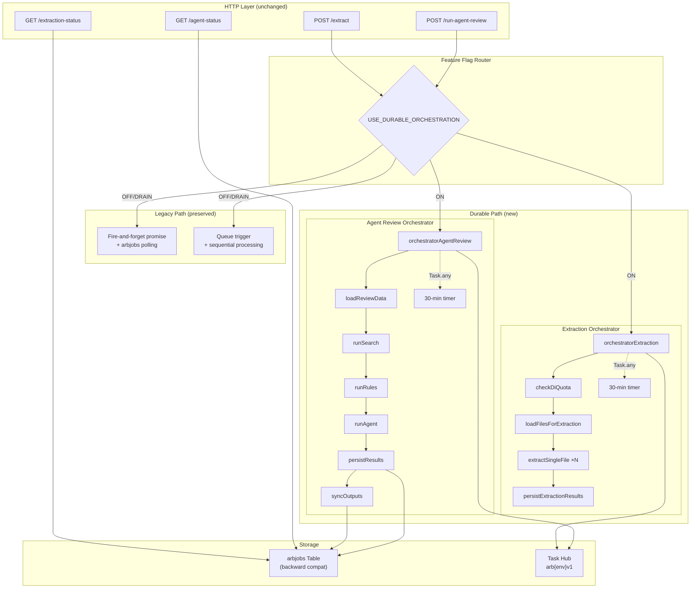

# Design Document: Durable Functions Migration

## Overview

This design migrates two long-running Azure Functions workflows — **Agent Review** and **Document Extraction** — from fire-and-forget/queue-triggered patterns to Azure Durable Functions orchestrations. The migration introduces automatic checkpointing, replay resilience, observable execution history, and bounded-concurrency fan-out while preserving the existing public API contract byte-for-byte.

The implementation uses `durable-functions` v3.x on the Node.js v4 programming model (`@azure/functions` ^4.14), running on the existing Linux Consumption plan (Y1). A tri-state feature flag (`USE_DURABLE_ORCHESTRATION`: `ON`/`OFF`/`DRAIN`) gates all traffic routing, enabling zero-downtime rollout and instant rollback without code deployments.

### Key Design Decisions

| Decision | Rationale |
|----------|-----------|
| Sequential orchestrator for agent review | The 6 phases have data dependencies (each feeds the next); parallelism adds complexity without benefit |
| Fan-out/fan-in for extraction | Files are independent; parallel processing with `maxConcurrentActivityFunctions=3` respects DI rate limits while improving throughput |
| SHA-256 instance IDs | Deterministic, hex-safe, prevents duplicate orchestrations, avoids Storage key encoding issues |
| No retry on `runAgent` activity | Foundry agent client already implements 3-retry with exponential backoff internally |
| Timer race (30 min) | Consumption plan has 10-min HTTP timeout but orchestrators can run longer; timer prevents zombie orchestrations |
| `arbjobs` table write on completion | Backward compatibility with existing frontend polling; durable status is an internal detail |
| Default Azure Storage provider | Simplest option for Consumption plan; no Netherite/MSSQL complexity needed at current scale |

---

## Architecture



### Execution Flow — Agent Review

1. HTTP handler reads feature flag → if `ON`, computes instance ID and calls `client.startNew()`
2. If instance already running, returns existing status (202 with `running`)
3. Orchestrator starts, races 30-min timer against sequential activity chain
4. Activities execute: `loadReviewData` → `runSearch` → `runRules` → `runAgent` → `persistResults` → `syncOutputs`
5. On success: writes `completed` to `arbjobs` table
6. On failure/timeout: writes `failed` to `arbjobs` table
7. GET /agent-status reads from `arbjobs` table (same as legacy)

### Execution Flow — Extraction

1. HTTP handler reads feature flag → if `ON`, computes instance ID and calls `client.startNew()`
2. Orchestrator starts, races 30-min timer against activity chain
3. `checkDiQuota` → if quota exceeded, fail with 429 info
4. `loadFilesForExtraction` → returns file list
5. Fan-out: schedule N `extractSingleFile` activities (bounded by `maxConcurrentActivityFunctions=3`)
6. Fan-in: aggregate all results
7. `persistExtractionResults` → write combined state to Table Storage + Search index
8. On success/failure: write status to `arbjobs` table for backward compat

---

## Components and Interfaces

### Feature Flag Module (`api/src/durable/shared/featureFlag.js`)

```javascript
/**
 * Reads USE_DURABLE_ORCHESTRATION from process.env at call time.
 * @returns {'ON' | 'OFF' | 'DRAIN'}
 */
function getDurableFlag() → 'ON' | 'OFF' | 'DRAIN'

/**
 * Returns true if new requests should use the durable path.
 */
function shouldUseDurable() → boolean
```

### Instance ID Module (`api/src/durable/shared/instanceId.js`)

```javascript
/**
 * Generates a deterministic, hex-safe instance ID.
 * @param {'review' | 'extraction'} prefix
 * @param {string} reviewId
 * @param {string} userId
 * @returns {string} First 48 hex chars of SHA-256("{prefix}:{reviewId}:{userId}")
 */
function computeInstanceId(prefix, reviewId, userId) → string
```

### Agent Review Orchestrator (`api/src/durable/orchestratorAgentReview.js`)

```javascript
/**
 * Durable Functions orchestrator.
 * Registered as 'orchestratorAgentReview'.
 * 
 * Input: { reviewId, principal, traceId }
 * Output: { agentReviewCompleted, findingsCount, recommendation, overallScore, ... }
 * 
 * Sequence:
 *   1. loadReviewData (with retry)
 *   2. runSearch (with retry)
 *   3. runRules (with retry)
 *   4. runAgent (NO retry — Foundry has internal retry)
 *   5. persistResults (with retry)
 *   6. syncOutputs (with retry)
 * 
 * Timer race: 30 minutes via Task.any([workflowTask, timerTask])
 * On timeout: writes failed status to arbjobs
 * On error: catches, writes failed status to arbjobs
 */
```

### Extraction Orchestrator (`api/src/durable/orchestratorExtraction.js`)

```javascript
/**
 * Durable Functions orchestrator.
 * Registered as 'orchestratorExtraction'.
 * 
 * Input: { reviewId, principal, requestedAt }
 * Output: { extractionCompleted, fileCount, successCount, errorCount }
 * 
 * Sequence:
 *   1. checkDiQuota (with retry)
 *   2. loadFilesForExtraction (with retry)
 *   3. Fan-out: extractSingleFile × N (with retry per file)
 *   4. persistExtractionResults (with retry)
 * 
 * Timer race: 30 minutes
 * Concurrency: bounded by host.json maxConcurrentActivityFunctions=3
 */
```

### Activity Functions

| Activity | Input | Output | Retry Policy |
|----------|-------|--------|--------------|
| `loadReviewData` | `{ reviewId, principal }` | `{ review, files, requirements, evidence, visualEvidence, actions }` | 3 attempts, 5s first, backoff 2 |
| `runSearch` | `{ review, requirements, evidence, reviewId }` | `{ searchChunks }` | 3 attempts, 5s first, backoff 2 |
| `runRules` | `{ review, requirements, evidence, files }` | `{ ruleFindings, ruleBlockers, criticalBlockerCount }` | 3 attempts, 5s first, backoff 2 |
| `runAgent` | `{ review, files, requirements, evidence, searchChunks, visualEvidence, ruleFindings }` | `{ agentResult }` | **None** (Foundry internal retry) |
| `persistResults` | `{ reviewId, principal, agentResult, ruleFindings, ... }` | `{ persisted: true }` | 3 attempts, 5s first, backoff 2 |
| `syncOutputs` | `{ reviewId, principal, review, agentResult, ... }` | `{ artifactsGenerated, exportsList }` | 3 attempts, 5s first, backoff 2 |
| `checkDiQuota` | `{ principal, fileCount }` | `{ quotaOk: true }` or throws | 3 attempts, 5s first, backoff 2 |
| `loadFilesForExtraction` | `{ reviewId, principal }` | `{ files: FileMetadata[] }` | 3 attempts, 5s first, backoff 2 |
| `extractSingleFile` | `{ reviewId, principal, file }` | `{ fileId, extractionStatus, extractedText, visualRecords[], errors[] }` | 3 attempts, 5s first, backoff 2 |
| `persistExtractionResults` | `{ reviewId, principal, results[] }` | `{ persisted: true, indexedChunks }` | 3 attempts, 5s first, backoff 2 |

### Retry Policy Configuration

```javascript
const DEFAULT_RETRY_OPTIONS = {
  firstRetryIntervalInMilliseconds: 5000,
  maxNumberOfAttempts: 3,
  backoffCoefficient: 2
};
```

---

## Data Models

### Orchestrator Input — Agent Review

```typescript
interface AgentReviewOrchInput {
  reviewId: string;
  principal: { userId: string; displayName?: string };
  traceId: string;
}
```

### Orchestrator Input — Extraction

```typescript
interface ExtractionOrchInput {
  reviewId: string;
  principal: { userId: string; displayName?: string };
  requestedAt: string; // ISO 8601
}
```

### Activity Result — extractSingleFile

```typescript
interface SingleFileExtractionResult {
  fileId: string;
  fileName: string;
  extractionStatus: 'Completed' | 'Failed' | 'Skipped';
  extractedText: string | null;
  visualRecords: VisualEvidenceRecord[];
  errors: string[];
  durationMs: number;
}
```

### arbjobs Table Entity (backward compat — unchanged)

```typescript
interface ArbJobEntity {
  partitionKey: string; // encodeTableKey(reviewId)
  rowKey: string;       // encodeTableKey(userId)
  status: 'running' | 'completed' | 'failed';
  traceId: string;
  startedAt: string;    // ISO 8601
  completedAt: string | null;
  resultJson: string | null;
  error: string | null;
}
```

### host.json — durableTask Configuration

```json
{
  "extensions": {
    "durableTask": {
      "hubName": "arb%ENVIRONMENT%v1",
      "maxConcurrentActivityFunctions": 3,
      "maxConcurrentOrchestratorFunctions": 5
    }
  }
}
```

### Instance ID Format

- Agent review: `SHA256("review:{reviewId}:{userId}")[0:48]` → 48 hex chars
- Extraction: `SHA256("extraction:{reviewId}:{userId}")[0:48]` → 48 hex chars

---


## Correctness Properties

*A property is a characteristic or behavior that should hold true across all valid executions of a system — essentially, a formal statement about what the system should do. Properties serve as the bridge between human-readable specifications and machine-verifiable correctness guarantees.*

### Property 1: Instance ID determinism and hex format

*For any* prefix string (`"review"` or `"extraction"`), any reviewId string, and any userId string, `computeInstanceId(prefix, reviewId, userId)` SHALL produce a string that is exactly 48 characters long, contains only hexadecimal characters `[0-9a-f]`, and equals the first 48 characters of the hex-encoded SHA-256 hash of `"{prefix}:{reviewId}:{userId}"`. Calling the function twice with the same inputs SHALL produce the same output.

**Validates: Requirements 2.4, 6.1, 6.2, 6.3**

### Property 2: Unrecognized feature flag values default to OFF

*For any* string value that is not exactly `"ON"` or `"DRAIN"` (including empty string, undefined, null, whitespace, mixed case like `"on"` or `"On"`, and arbitrary random strings), `getDurableFlag()` SHALL return `"OFF"` and `shouldUseDurable()` SHALL return `false`.

**Validates: Requirements 1.4**

### Property 3: API contract response shape completeness

*For any* valid job state (idle, running, completed, or failed) with arbitrary field values, the corresponding API response object SHALL contain all required fields with correct types: `idle` → `{reviewId: string, status: "idle", message: string}`; `running` → `{reviewId: string, traceId: string, status: "running", startedAt: string, elapsedMs: number, message: string}`; `completed` → `{reviewId: string, traceId: string, status: "completed", startedAt: string, completedAt: string, agentReviewCompleted: boolean, findingsCount: number, recommendation: string, overallScore: number, confidenceLevel: string}`; `failed` → `{reviewId: string, traceId: string, status: "failed", startedAt: string, completedAt: string, error: string}`.

**Validates: Requirements 3.1, 3.2, 3.3, 3.4**

### Property 4: Error response shape invariant

*For any* HTTP error response (status codes 400, 404, 429, 503), the response body SHALL be a JSON object containing exactly an `error` field of type string, and no additional unexpected fields that would break frontend parsing.

**Validates: Requirements 10.4**

### Property 5: JSON serialization round-trip

*For any* valid API response payload (success or error), parsing the JSON string, serializing it back to JSON, and parsing again SHALL produce an object deeply equal to the first parse result. This ensures no response contains values that are not JSON-round-trip safe (e.g., undefined, functions, circular references, Date objects).

**Validates: Requirements 10.5**

### Property 6: Fan-out activity count equals file count

*For any* list of N files (where N ≥ 1) returned by `loadFilesForExtraction`, the extraction orchestrator SHALL schedule exactly N `extractSingleFile` activity calls, one per file, with no duplicates and no omissions.

**Validates: Requirements 4.3**

### Property 7: extractSingleFile result completeness

*For any* file input (regardless of file type, size, or extraction outcome), the `extractSingleFile` activity SHALL return an object containing all required fields: `fileId` (string), `extractionStatus` (one of "Completed", "Failed", "Skipped"), `extractedText` (string or null), `visualRecords` (array), and `errors` (array). The result SHALL be self-contained with no references to shared mutable state.

**Validates: Requirements 4.4**

---

## Error Handling

### Orchestrator-Level Error Handling

| Scenario | Behavior |
|----------|----------|
| Activity throws unhandled error | Orchestrator catches in try/catch, writes `status: "failed"` + error message to `arbjobs` table |
| Timer wins race (30-min timeout) | Orchestrator writes `status: "failed"` with message `"Orchestration timed out after 30 minutes"` to `arbjobs` |
| Duplicate instance start | HTTP handler detects running instance via `client.getStatus()`, returns existing status (no new orchestration) |
| DI quota exceeded (extraction) | `checkDiQuota` throws with quota info; orchestrator catches and writes failure with 429-equivalent details |
| Feature flag is DRAIN | New requests route to legacy; in-flight orchestrations continue to completion naturally |

### Activity-Level Error Handling

- Activities with retry policy (all except `runAgent`): transient failures (network, throttling) are retried up to 3 times with exponential backoff (5s, 10s, 20s)
- `runAgent` activity: no retry policy applied by the orchestrator; the Foundry agent client handles its own 3-retry with exponential backoff internally
- Non-retryable errors (4xx from Azure services, validation errors): bubble up immediately to orchestrator error handler

### HTTP Handler Error Responses

| Condition | Status | Body |
|-----------|--------|------|
| Unauthenticated request | 401 | `{ error: "Authentication required." }` |
| Review not found | 404 | `{ error: "Review not found." }` |
| No files uploaded | 400 | `{ error: "Upload files before starting extraction." }` |
| Rate limit exceeded | 429 | `{ error: "Rate limit exceeded. Retry after Xs." }` |
| Foundry not configured | 503 | `{ error: "Foundry agent is not configured on this deployment." }` |
| Internal error | 500 | `{ error: "Unable to start assessment." }` |

### Graceful Degradation

- If the durable client fails to start an orchestration (e.g., Storage unavailable), the HTTP handler returns 503 with a clear error message
- The legacy path remains fully functional when the flag is `OFF` or `DRAIN`, providing an immediate fallback
- Orchestration state is persisted in the task hub; if the function app restarts mid-orchestration, replay resumes from the last checkpoint

---

## Testing Strategy

### Unit Tests

Unit tests verify individual components in isolation with mocked dependencies:

- **Feature flag module**: Test `getDurableFlag()` and `shouldUseDurable()` with various env values
- **Instance ID module**: Test `computeInstanceId()` with known inputs and verify hex output
- **Activity functions**: Each activity tested with mocked SDK clients (Table Storage, Search, Foundry)
- **Orchestrator replay**: Mock `context.df` to verify activity call sequence, timer creation, and error handling

### Property-Based Tests

Property-based testing is appropriate for this feature because:
- The instance ID function is a pure function with clear input/output behavior
- The feature flag router has a universal property (all non-ON/DRAIN values → OFF)
- API contract shapes must hold across all possible field values
- JSON round-trip is a classic serialization property

**Library**: [fast-check](https://github.com/dubzzz/fast-check) (standard PBT library for Node.js/TypeScript)

**Configuration**:
- Minimum 100 iterations per property test
- Each property test tagged with design document reference
- Tag format: **Feature: durable-functions-migration, Property {number}: {property_text}**

**Property tests to implement**:
1. Instance ID determinism and hex format (Property 1)
2. Feature flag default behavior (Property 2)
3. API contract response shapes (Property 3)
4. Error response shape invariant (Property 4)
5. JSON round-trip for responses (Property 5)
6. Fan-out count equals file count (Property 6)
7. extractSingleFile result completeness (Property 7)

### Contract Tests

Frozen JSON schema tests that validate response shapes against the frontend expectations:

- `POST /run-agent-review` → 202 response schema
- `GET /agent-status` → 200 response schemas (idle, running, completed, failed)
- `POST /extract` → 202 response schema
- Error responses (400, 404, 429, 503) → `{ error: string }` schema

### Integration Tests

Run locally with Azurite + Azure Functions Core Tools:

- Full orchestrator execution with mocked external services
- Timer race behavior (accelerated timer for test)
- Duplicate instance detection
- Feature flag routing end-to-end
- `arbjobs` table backward compatibility

### Orchestrator Replay Tests

Verify Durable Functions replay semantics:

- Activities are called in correct order
- Retry policies are applied correctly (except `runAgent`)
- Timer race resolves correctly in both win/lose scenarios
- Error propagation and `arbjobs` write on failure

### Test File Structure

```
api/src/durable/tests/
├── orchestratorAgentReview.test.js    # Orchestrator replay + error handling
├── orchestratorExtraction.test.js     # Fan-out/fan-in + quota gate
├── activities.test.js                 # Individual activity unit tests
├── contract.test.js                   # Response shape contract tests
├── instanceId.property.test.js        # Property: instance ID (Property 1)
├── featureFlag.property.test.js       # Property: flag defaults (Property 2)
├── apiContract.property.test.js       # Properties: response shapes (Properties 3-5)
└── fanout.property.test.js            # Properties: fan-out + result shape (Properties 6-7)
```
