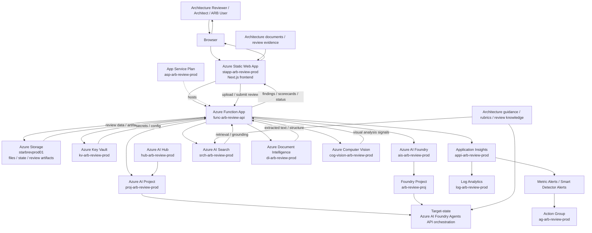

# Architecture Overview

## Purpose

Cloud Architecture Review Intelligence is an enterprise-ready platform for evaluating cloud architectures using a combination of AI-assisted analysis, deterministic governance checks, evidence extraction, and Azure-native operational patterns.

This document provides a concise architecture overview for engineering teams, platform teams, solution architects, and technical stakeholders who need to understand how the solution is structured, how its deployed Azure components interact, and how the platform is expected to evolve.

## Architectural goals

The solution is intended to achieve the following goals:

- enable repeatable and scalable architecture review workflows
- improve consistency and traceability of architecture assessments
- combine AI-assisted reasoning with deterministic validation
- support secure, Azure-native deployment patterns
- maintain a modular structure across frontend, API, AI, and infrastructure layers
- provide a foundation for enterprise governance, observability, and controlled evolution

## Current-state deployed architecture

The solution is currently backed by a deployed Azure environment in resource group **`rg-arb-review-prod`**. The deployed estate confirms that this repository represents a real Azure-native platform, not only a target-state design.

### Primary deployment characteristics

- **Primary resource group:** `rg-arb-review-prod`
- **Primary region:** `East US 2`
- **Azure AI Search region:** `East US`
- **Global resources:** alerting and action group components
- **Deployment model:** frontend + serverless API + Azure AI services + document processing + search + observability + security controls

### Current deployed Azure services

| Category | Services |
|---|---|
| User experience | Azure Static Web Apps |
| Application runtime | Azure Functions, App Service Plan |
| Storage | Azure Storage |
| AI platform | Azure AI Foundry, Azure AI Hub, Azure AI Projects |
| Knowledge and retrieval | Azure AI Search |
| Document and image analysis | Azure Document Intelligence, Azure Computer Vision |
| Security | Azure Key Vault |
| Monitoring | Application Insights, Log Analytics |
| Alerting | Metric Alerts, Smart Detector Alert, Action Group |

## High-level architecture

At a high level, the platform is composed of four logical layers:

### 1. Experience layer
The frontend provides the user-facing experience for architecture review workflows.

Responsibilities include:
- collecting review inputs
- displaying architecture findings and scorecards
- supporting workflow navigation and review operations
- providing a modern, accessible web experience

Repository location:
- [`frontend/`](./frontend)

Indicative technologies:
- Next.js
- React
- TypeScript-based configuration and tooling

### 2. Application and orchestration layer
The backend provides the API and orchestration capabilities required for review execution.

Responsibilities include:
- receiving and validating review requests
- orchestrating document analysis and AI-assisted processing
- coordinating rule evaluation and business logic
- handling storage and review lifecycle operations
- exposing service endpoints to the frontend

Repository location:
- [`api/`](./api)

Indicative technologies:
- Azure Functions
- Node.js
- Azure SDKs for identity, storage, and document processing

### 3. AI and knowledge layer
The AI layer provides the intelligence and grounding mechanisms that support review quality.

Responsibilities include:
- extracting information from uploaded review artifacts
- searching and retrieving relevant supporting knowledge
- supporting structured AI-assisted reasoning
- grounding outputs in evidence and curated guidance

The current platform and design documentation indicate use of:
- Azure AI Foundry resources and project-oriented AI orchestration
- Azure AI Search for retrieval and grounding
- Azure Document Intelligence for document extraction
- Azure Computer Vision for visual analysis support
- evolving Azure AI Foundry Agents API patterns for future state execution

### 4. Platform and operations layer
The infrastructure layer provides deployment, security, observability, and operational support.

Responsibilities include:
- provisioning Azure resources
- storing secrets and configuration securely
- enabling monitoring and diagnostics
- supporting repeatable environment setup
- enabling scalable enterprise deployment patterns

Repository location:
- [`infrastructure/`](./infrastructure)

## Architecture diagram

The diagram below reflects the **current deployed Azure platform** and the **target-state evolution** toward deeper Foundry agent orchestration.

## Reference deployment model

Based on the current repository documentation and deployed Azure inventory, the solution includes the following major services:

- **Azure Static Web Apps** for frontend hosting
- **Azure Functions** for API hosting and orchestration
- **Azure AI Foundry / Azure AI Hub / Azure AI Projects** for AI orchestration patterns
- **Azure AI Foundry Agents API** as a target-state direction for deeper agent-driven review execution
- **Azure AI Search** for knowledge retrieval and document search
- **Azure Document Intelligence** for document extraction
- **Azure Computer Vision** for visual analysis support
- **Azure Storage** for files, state, and related review artifacts
- **Azure Key Vault** for secrets and secure configuration
- **Application Insights** and **Log Analytics** for observability
- **Metric Alerts, Smart Detector Alerts, and Action Groups** for operational monitoring

## Logical flow

A representative end-to-end review flow is as follows:

1. A user initiates a review through the frontend.
2. The frontend sends the request to backend APIs.
3. The backend accepts review input and supporting artifacts.
4. Documents are processed using document and visual analysis services.
5. Search and retrieval logic identifies supporting architecture knowledge.
6. Deterministic rules and AI-assisted evaluation contribute to the review outcome.
7. Findings, scorecards, and other structured outputs are generated.
8. Results are persisted and presented back through the frontend.
9. Telemetry and diagnostics capture operational insights for support and improvement.
10. Alerts and action groups provide operational response capability.

## Security model

The repository documentation and deployed Azure services strongly indicate an enterprise-oriented security approach built around:

- managed identity where possible
- Azure Key Vault for secret management
- Azure-native role assignment and service access controls
- separation of environments for local, test, and production deployments
- avoidance of plaintext secrets in application code
- centralized monitoring and alerting

Recommended security principles for this solution include:
- least-privilege access
- secure secret handling
- environment isolation
- centralized observability
- auditable deployment and configuration management

## Engineering model

The repository structure suggests a professional engineering approach that includes:

- separated frontend and backend concerns
- infrastructure-as-code alignment
- automated and targeted testing patterns
- documentation-driven architecture planning
- support for accessibility, visual regression, and end-to-end validation
- enterprise-oriented documentation and repository governance

## Key repository areas

- [`README.md`](./README.md) — repository overview and business context
- [`docs/arb-foundry-agents-solution-plan.md`](./docs/arb-foundry-agents-solution-plan.md) — target solution architecture and deployment design
- [`docs/arb-implementation-test-validation-guide.md`](./docs/arb-implementation-test-validation-guide.md) — implementation and validation guidance
- [`docs/architecture/solution-architecture-diagram.md`](./docs/architecture/solution-architecture-diagram.md) — architecture diagram and explanation
- [`api/`](./api) — Azure Functions backend
- [`frontend/`](./frontend) — user experience layer
- [`infrastructure/`](./infrastructure) — deployment assets

## Current state vs target state

### Current state
The platform is already deployed as a multi-service Azure solution with working frontend, API, AI, search, security, storage, and observability components.

### Target state
The platform continues to evolve toward a richer **Foundry agent operating model**, where more of the architecture review workflow is orchestrated through Azure AI Foundry Agents API patterns, vector-store-backed grounding, and stronger evidence-aware review automation.

## Architectural principles

This solution should continue to evolve according to the following principles:

- design for clarity and maintainability
- prefer Azure-native security and operations patterns
- ground AI outputs in evidence where possible
- combine deterministic rules with AI-assisted insight
- keep the system modular and testable
- optimize for enterprise adoption, governance, and operational maturity

## Future evolution

Likely future evolution areas include:

- deeper Foundry agent integration
- expanded review rules and governance rubrics
- richer review scorecards and reporting
- more robust deployment automation
- stronger architecture evidence traceability
- broader operational dashboards and governance analytics
