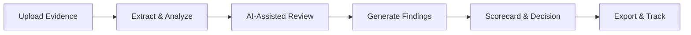
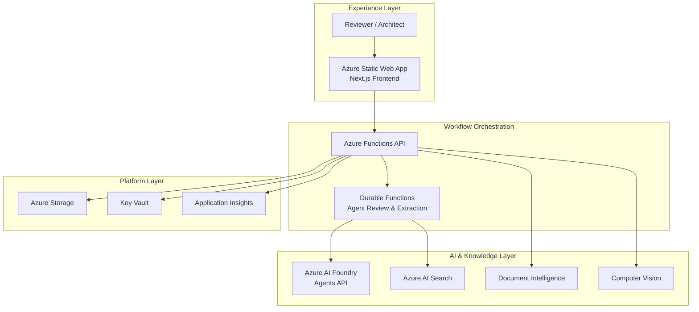

# Cloud Architecture Review Intelligence

> Enterprise-grade AI-powered architecture review platform for Azure and hybrid cloud environments.

[](./frontend)
[](./api)
[](./infrastructure)
[](./LICENSE)
[](https://nodejs.org/)
[](https://github.com/upendra25312/Cloud-Architecture-Review-Intelligence/actions)

Cloud Architecture Review Intelligence (CARI) is a professional solution accelerator for organizations that need to assess cloud architectures with greater **speed**, **consistency**, and **governance rigor**. It combines **Azure-native application architecture**, **AI-assisted review workflows**, **document intelligence**, **search**, **observability**, and **deterministic validation patterns** to support architecture review boards, cloud centers of excellence, platform engineering teams, and enterprise solution architects.

**Live Platform:** [https://red-coast-0b2d8700f.7.azurestaticapps.net/arb](https://red-coast-0b2d8700f.7.azurestaticapps.net/arb)

---

## Table of Contents

- [Executive Summary](#executive-summary)
- [What's New](#whats-new)
- [Business Value](#business-value)
- [Platform Capabilities](#platform-capabilities)
- [Architecture Overview](#architecture-overview)
- [Technology Stack](#technology-stack)
- [Getting Started](#getting-started)
- [Single-Command Azure Deployment](#single-command-azure-deployment)
- [Documentation](#documentation)
- [Contributing](#contributing)
- [License](#license)

---

## Executive Summary

Enterprise architecture reviews are often constrained by manual assessment processes, fragmented evidence, and inconsistent interpretation across reviewers. Cloud Architecture Review Intelligence addresses those challenges by providing a structured review platform that helps teams evaluate architecture submissions using:

- **AI-assisted reasoning** for contextual review and guided assessment
- **Evidence-grounded workflows** for better traceability and defensibility
- **Deterministic rules and scoring patterns** for review consistency
- **Azure Durable Functions** for reliable, scalable workflow orchestration
- **Azure-native deployment architecture** for security, scalability, and operational readiness

The result is a platform that reduces review cycle time, improves quality of decision-making, and strengthens governance outcomes across Azure and hybrid cloud environments.

---

## What's New

### May 2026 Release

#### Azure Durable Functions Migration
The platform now leverages **Azure Durable Functions** for enterprise-grade workflow orchestration:

| Capability | Description |
|------------|-------------|
| **Agent Review Orchestration** | Reliable, resumable AI-powered architecture reviews with automatic retry and state persistence |
| **Extraction Fan-Out Pattern** | Parallel document processing with configurable concurrency for high-throughput evidence extraction |
| **Feature Flag Control** | Gradual rollout capability with instant rollback via `DURABLE_FUNCTIONS_ENABLED` flag |
| **Enhanced Observability** | Structured logging, custom metrics, and Azure Monitor alerts for workflow health |

#### Finding-Action Synchronization
Automatic synchronization between findings and remediation actions:

| Feature | Behavior |
|---------|----------|
| **Status Sync** | Finding status changes automatically update linked action status |
| **Owner Sync** | Owner assignments propagate to linked actions when appropriate |
| **Due Date Sync** | Due date changes sync to linked actions |
| **Closure Notes** | Reviewer notes append to action closure notes when findings are closed |
| **Critical Blocker** | Critical blocker flags sync to reviewer verification requirements |

#### Enhanced Error Handling
- Graceful 401 authentication error handling with user-friendly login prompts
- Improved error messages throughout the review workflow
- Better handling of edge cases in the review library

---

## Business Value

From an enterprise architecture, governance, and pre-sales perspective, this solution helps organizations:

| Value Area | Impact |
|------------|--------|
| **Review Cycle Time** | Reduce architecture review board processes from weeks to days |
| **Decision Consistency** | Improve consistency of technical and governance decisions across reviewers |
| **Manual Effort** | Reduce dependency on purely manual document review |
| **Reusable Standards** | Create reusable review standards and architecture rubrics |
| **Scalable Governance** | Operationalize architecture review as a scalable digital capability |

---

## Platform Capabilities

### Core Review Workflow



### AI-Assisted Architecture Assessment
- Azure AI Foundry Agents API for contextual interpretation
- Evidence-grounded review outputs with citation requirements
- Support for WAF, CAF, and custom governance rubrics

### Document Intelligence & Visual Evidence
- PDF, DOCX, PPTX, XLSX extraction via Azure Document Intelligence
- Diagram analysis from Draw.io, Visio, and embedded images
- Office native-shape rendering for complex diagrams
- Visual evidence tracking with `visualEvidenceId` citations

### Durable Workflow Orchestration
- **Agent Review Orchestrator**: Reliable AI review execution with automatic retry
- **Extraction Fan-Out Orchestrator**: Parallel document processing at scale
- State persistence and workflow resumability
- Feature flag-controlled rollout

### Governance & Compliance
- Deterministic rule validation alongside AI analysis
- Structured findings with severity, domain, and ownership
- Scorecard generation with domain-level breakdowns
- Decision recording with rationale capture

---

## Architecture Overview

### Deployed Azure Services

| Category | Services |
|----------|----------|
| **Frontend** | Azure Static Web Apps |
| **API & Compute** | Azure Functions, Azure Durable Functions, Azure Container Apps |
| **AI Platform** | Azure AI Foundry, Azure AI Hub, Azure AI Projects |
| **Document Processing** | Azure Document Intelligence, Azure Computer Vision |
| **Search & Knowledge** | Azure AI Search |
| **Storage** | Azure Blob Storage, Azure Table Storage |
| **Security** | Azure Key Vault, Managed Identity |
| **Observability** | Application Insights, Log Analytics, Azure Monitor Alerts |

### Architecture Diagram



---

## Technology Stack

| Layer | Technology |
|-------|------------|
| **Frontend** | Next.js 16, React 19, TypeScript |
| **Backend** | Azure Functions v4, Node.js 20+, Azure Durable Functions |
| **AI Services** | Azure AI Foundry, Azure AI Search, Document Intelligence, Computer Vision |
| **Infrastructure** | Terraform, Azure Container Apps, Azure Container Registry |
| **Testing** | Vitest, Playwright, Node.js native test runner |
| **CI/CD** | GitHub Actions with OIDC authentication |

---

## Getting Started

### Prerequisites

- Node.js 20 or later
- npm
- Azure subscription with appropriate permissions
- Azure CLI 2.60+

### Quick Start

```bash
# Clone the repository
git clone https://github.com/upendra25312/Cloud-Architecture-Review-Intelligence.git
cd Cloud-Architecture-Review-Intelligence

# Install frontend dependencies
cd frontend && npm install

# Install API dependencies
cd ../api && npm install

# Run tests
npm test

# Start local development
cd ../frontend && npm run dev
```

### Configuration

Copy the sample configuration and update with your Azure service endpoints:

```bash
cp api/local.settings.sample.json api/local.settings.json
```

Key configuration settings:

| Setting | Purpose |
|---------|---------|
| `DURABLE_FUNCTIONS_ENABLED` | Enable/disable Durable Functions orchestration |
| `AZURE_DOCUMENT_INTELLIGENCE_ENDPOINT` | Document extraction service |
| `OFFICE_RENDERER_ENDPOINT` | Office native-shape rendering service |

---

## Single-Command Azure Deployment

CARI is being prepared for a full Azure Developer CLI deployment path where a cloud engineer can provision and deploy the complete solution with:

```bash
azd up
```

and tear down a non-production environment with:

```bash
azd down --purge
```

The target `azd up` flow provisions Azure infrastructure with Terraform, deploys the Azure Functions API, deploys the Next.js frontend to Azure Static Web Apps, builds and deploys the Office renderer to Azure Container Apps, configures Function App settings, and runs smoke tests.

Use GitHub Actions for the current production/live deployment path. Use the AZD plan for dev, demo, onboarding, and clean rebuild environments until the AZD path is fully validated.

See [CARI Single-Command Azure Deployment Plan](./docs/azd-up-down-deployment-plan.md) for the engineer runbook, prerequisites, architecture mapping, required repository changes, validation gates, and teardown guidance.

---

## Documentation

| Document | Description |
|----------|-------------|
| [Wiki Home](https://github.com/upendra25312/Cloud-Architecture-Review-Intelligence/wiki) | Implementation guide and operational documentation |
| [Architecture Overview](./ARCHITECTURE.md) | Detailed architecture documentation |
| [AZD Deployment Plan](./docs/azd-up-down-deployment-plan.md) | Plan and runbook for `azd up` / `azd down` deployment |
| [Solution Plan](./docs/arb-foundry-agents-solution-plan.md) | Architecture decisions and cost model |
| [Implementation Guide](./docs/arb-implementation-test-validation-guide.md) | Deployment and validation procedures |
| [Durable Functions Runbook](./docs/durable-functions-rollback-runbook.md) | Operational procedures for workflow orchestration |
| [Finding-Action Sync Design](./docs/FINDING-ACTION-SYNC-DESIGN.md) | Design documentation for sync feature |

---

## Repository Structure

```
Cloud-Architecture-Review-Intelligence/
├── .github/                    # GitHub workflows and CI/CD
├── api/                        # Azure Functions backend
│   └── src/
│       ├── durable/           # Durable Functions orchestrators & activities
│       ├── functions/         # HTTP-triggered functions
│       └── shared/            # Shared services and utilities
├── docs/                       # Architecture and implementation docs
├── frontend/                   # Next.js frontend application
├── infrastructure/             # Terraform IaC
│   └── terraform/
│       ├── functions.tf       # Durable Functions configuration
│       └── monitoring.tf      # Alerts and observability
├── services/                   # Supporting services
│   └── office-renderer/       # Office document rendering service
├── ARCHITECTURE.md
└── README.md
```

---

## Testing

```bash
# Run all API tests (47 tests)
cd api && npm test

# Run frontend unit tests
cd frontend && npm run test:unit

# Run end-to-end tests
cd frontend && npm run test:e2e

# Run accessibility tests
cd frontend && npm run test:e2e:a11y
```

---

## Contributing

Contributions are welcome. See [CONTRIBUTING.md](./CONTRIBUTING.md) for guidelines.

Areas of interest:
- Architecture governance rules and rubrics
- Frontend usability improvements
- Backend reliability and observability
- Documentation and onboarding experience
- Test coverage expansion

---

## License

This repository is licensed under the **MIT License**. See [LICENSE](./LICENSE) for details.

---

## Contact

- **Wiki:** [Implementation Guide](https://github.com/upendra25312/Cloud-Architecture-Review-Intelligence/wiki)
- **Issues:** [GitHub Issues](https://github.com/upendra25312/Cloud-Architecture-Review-Intelligence/issues)
- **Discussions:** [GitHub Discussions](https://github.com/upendra25312/Cloud-Architecture-Review-Intelligence/discussions)
