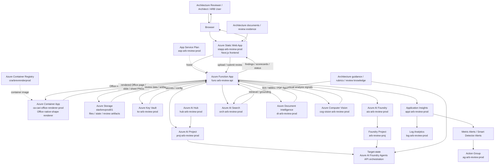

# Solution Architecture Diagram

This document provides the primary architecture diagram for Cloud Architecture Review Intelligence.

The diagram is based on:
- the repository codebase and structure
- the current Azure resource inventory shared for the deployed environment
- the solution planning documents in `docs/`
- the documented target-state direction toward Azure AI Foundry agent orchestration

## Current-state and target-state architecture

## Diagram interpretation

### Experience layer
- **Azure Static Web App (`stapp-arb-review-prod`)** hosts the Next.js frontend.
- Users interact with the system through browser-based architecture review workflows.

### Application and orchestration layer
- **Azure Function App (`func-arb-review-api`)** handles API orchestration, review processing, integrations, and business logic.
- **App Service Plan (`asp-arb-review-prod`)** provides the hosting plan context for the function app.
- **Azure Container App (`ca-cari-office-renderer-prod`)** renders DOCX, PPTX, and XLSX native Office visual content to PNG when embedded-media extraction is not enough.
- **Azure Container Registry (`crarbrevrenderprod`)** stores the CARI Office Renderer container image deployed by GitHub Actions.

### AI, search, and document intelligence layer
- **Azure AI Foundry (`ais-arb-review-prod`)**, **Azure AI Hub (`hub-arb-review-prod`)**, and **Azure AI Projects (`proj-arb-review-prod`, `arb-review-proj`)** represent the AI platform foundation.
- **Azure AI Search (`srch-arb-review-prod`)** supports retrieval and evidence grounding.
- **Azure Document Intelligence (`di-arb-review-prod`)** supports structured extraction from uploaded review documents.
- **Azure Computer Vision (`cog-vision-arb-review-prod`)** supports visual analysis scenarios where needed.
- The CARI API persists both text/table `evidenceFacts[]` and diagram-derived `visualEvidence[]` before invoking `cari-arb-review-agent`.
- The architecture is evolving toward a deeper **Azure AI Foundry Agents API** pattern for richer review orchestration.

### Visual evidence pre-processing
- PDF documents are processed with Document Intelligence layout extraction, including figure detection where available.
- Diagram-heavy PDF pages use page-render fallback when figure crops are not returned.
- DOCX, PPTX, and XLSX files are inspected for embedded media and then rendered through the Office renderer for native shapes, SmartArt, charts, slide objects, and sheet visuals.
- Standalone image uploads are persisted as visual evidence and analyzed directly.
- The ARB agent must cite `visualEvidenceId` for any finding based on visual evidence.

### Data, security, and operations layer
- **Azure Storage (`starbrevprod01`)** stores documents, state, and review-related artifacts.
- **Azure Key Vault (`kv-arb-review-prod`)** secures secrets and configuration.
- **Application Insights (`appi-arb-review-prod`)** and **Log Analytics (`log-arb-review-prod`)** provide observability.
- **Metric Alerts**, **Smart Detector Alerts**, and **Action Groups (`ag-arb-review-prod`)** provide operational monitoring and response capability.

## Current-state vs target-state note

This diagram is intentionally designed to show both:
- the **current deployed Azure platform**, and
- the **target-state evolution** toward agent-first orchestration.

That is the most accurate representation of the solution based on the repository, deployed resource inventory, and planning documents.
